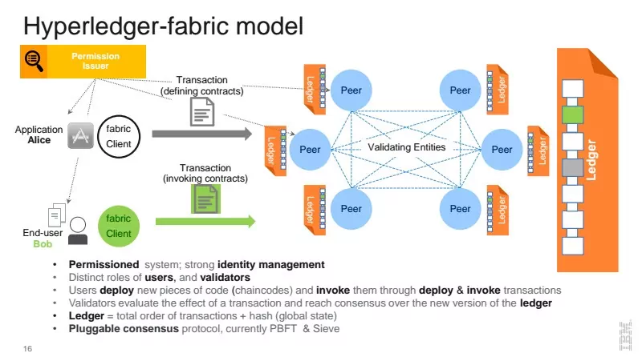

# MediGuardian

# Sarim Sohail - 101416162

# REQUIREMENTS:

# PROBLEM STATEMENT:

Counterfeit medicines pose a significant threat to public health worldwide. According to the World Health Organization (WHO), counterfeit medicines can be found in all therapeutic categories and affect both developed and developing countries. These counterfeit medicines often contain harmful substances, have incorrect dosages, or lack active ingredients, leading to treatment failures, drug resistance, and even death.

Current supply chain systems in the pharmaceutical industry lack transparency and traceability, making it difficult to detect and prevent the circulation of counterfeit medicines. Paper-based records, manual processes, and lack of interoperability among different stakeholders in the supply chain result in inefficiencies, delays, and increased risks of counterfeit medicines entering the market.

# GOALS:

The goal of this project is to create a solution using Hyperledger Fabric, a permissioned blockchain framework, to address the issue of counterfeit medicines in the pharmaceutical supply chain. The solution aims to achieve the following goals:

1. Transparency: Implement a transparent supply chain system that allows stakeholders to track and verify the movement of medicines at each stage of the supply chain, from manufacturing to distribution to dispensing.

2. Traceability: Enable end-to-end traceability of medicines by recording all relevant information, such as batch numbers, expiration dates, and serial numbers, on the blockchain. This will help in identifying the origin and movement of medicines, making it easier to detect and prevent counterfeit medicines.

3. Authenticity: Implement a system for verifying the authenticity of medicines at each stage of the supply chain. This can be achieved through the use of unique identifiers, such as QR codes or RFID tags, which can be scanned and verified on the blockchain.

4. Efficiency: Streamline supply chain processes by automating data recording and verification using smart contracts, reducing paperwork, manual errors, and delays. This will enable faster and more efficient movement of medicines, ensuring their timely availability and reducing the risks of counterfeit medicines entering the market.

5. Security: Ensure the security and integrity of data on the blockchain through the use of cryptographic techniques, access controls, and consensus algorithms provided by Hyperledger Fabric.

# GLOSSARY:

1. Hyperledger Fabric: A permissioned blockchain framework that provides features such as privacy, scalability, and security for building enterprise blockchain applications.

2. Counterfeit Medicines: Medicines that are intentionally and fraudulently mislabeled with respect to identity or source, or both, and may include products with the correct ingredients or with the wrong ingredients, without active ingredients, with insufficient active ingredients, or with fake packaging.

3. Transparency: The quality of being open, honest, and easily understood, allowing stakeholders to have a clear view of the movement and authenticity of medicines in the supply chain.

4. Traceability: The ability to track and trace the movement of medicines throughout the supply chain, recording relevant information at each stage to create an audit trail.

5. Authenticity: The quality of being genuine or legitimate, ensuring that medicines are not counterfeit and can be verified as authentic at each stage of the supply chain.

6. Smart Contracts: Self-executing contracts with the terms of the agreement directly written into code, automatically enforcing the terms and conditions without the need for intermediaries.

# STAKEHOLDERS:

1. Manufacturer: The entity responsible for producing medicines and adding relevant information, such as batch numbers, to the blockchain.

2. Distributor: The entity responsible for distributing medicines from the manufacturer to the pharmacy or other dispensing points, and recording the movement on the blockchain.

3. Pharmacy: The entity responsible for dispensing medicines to patients and verifying the authenticity of medicines using the blockchain.

4. Regulators: Government agencies or other regulatory bodies responsible for overseeing the pharmaceutical industry, ensuring compliance with regulations, and verifying the authenticity of medicines using the blockchain.

5. Patients: The end consumers of medicines who can verify the authenticity of the medicines they receive from the pharmacy using the blockchain.

# SOLUTION OVERVIEW:

The proposed solution will leverage Hyperledger Fabric to create a permissioned blockchain network that includes stakeholders such as manufacturers, distributors, pharmacies, regulators, and patients. The solution will use smart contracts to automate processes, record relevant information on the blockchain, and enable stakeholders to track and verify the movement of medicines in the supply chain.

The key components of the solution include:

1. Permissioned Blockchain Network: A private and permissioned Hyperledger Fabric blockchain network will be created, where only authorized stakeholders will have access to participate in the network. This will ensure privacy, security, and control over the data and transactions.

2. Smart Contracts: Smart contracts will be developed using Chaincode in Hyperledger Fabric to automate processes and enforce business rules. Smart contracts will be deployed on the blockchain and will govern the movement of medicines, recording relevant information, and triggering events such as authenticity verification.

3. Unique Identifiers: Unique identifiers, such as QR codes or RFID tags, will be assigned to each batch or unit of medicines, which will be recorded on the blockchain. These identifiers will enable stakeholders to track and verify the authenticity of medicines throughout the supply chain.

4. Data Recording and Verification: Relevant information, such as batch numbers, expiration dates, serial numbers, and authenticity verification results, will be recorded on the blockchain at each stage of the supply chain. Stakeholders, such as manufacturers, distributors, and pharmacies, will verify the authenticity of medicines using the unique identifiers and record the verification results on the blockchain.

5. User Interfaces: User interfaces, such as web or mobile applications, will be developed for stakeholders to interact with the blockchain network. These interfaces will allow stakeholders to track and verify the movement and authenticity of medicines, as well as record relevant information on the blockchain.

6. Integration with Existing Systems: The solution will be designed to integrate with existing systems used by stakeholders, such as inventory management systems, point-of-sale systems, and regulatory databases. This will enable seamless data exchange and interoperability among different stakeholders in the supply chain.

  

# IMPLEMENTATION STEPS:

The implementation of the solution will involve the following steps:

1. Define the business rules and requirements: Collaborate with stakeholders, such as manufacturers, distributors, pharmacies, regulators, and patients, to define the business rules and requirements for the solution. This includes identifying the relevant information to be recorded on the blockchain, defining the authenticity verification process, and determining the roles and permissions of different stakeholders in the network.

2. Design the blockchain network: Design the permissioned blockchain network using Hyperledger Fabric, including the creation of channels, organizations, peers, and orderers. Define the consensus mechanism, cryptographic techniques, and access controls to ensure the security and integrity of the network.

3. Develop smart contracts: Develop smart contracts using Chaincode in Hyperledger Fabric, based on the defined business rules and requirements. Test and deploy the smart contracts on the blockchain network.

4. Develop user interfaces: Develop user interfaces, such as web or mobile applications, for stakeholders to interact with the blockchain network. Design the interfaces to enable stakeholders to track and verify the movement and authenticity of medicines, as well as record relevant information on the blockchain.

5. Develop unique identifier system: Develop a system for assigning unique identifiers, such as QR codes or RFID tags, to each batch or unit of medicines. Integrate the unique identifier system with the smart contracts and the blockchain network to enable tracking and verification of medicines.

6. Test and Deploy: Conduct thorough testing of the solution to ensure its functionality, security, and performance. Collaborate with stakeholders to validate the solution and make necessary improvements. Once the solution is tested and approved, deploy it to the production environment.

7. Integrate with Existing Systems: Integrate the blockchain solution with existing systems used by stakeholders, such as inventory management systems, point-of-sale systems, and regulatory databases. Ensure seamless data exchange and interoperability among different stakeholders in the supply chain.

8. Provide Training and Support: Provide training and support to stakeholders on how to use the blockchain solution and interact with the user interfaces. Provide documentation and resources for stakeholders to understand the benefits and usage of the solution. Offer ongoing support to address any issues or concerns that may arise during the implementation and operation of the solution.

9. Monitor and Maintain: Regularly monitor the blockchain network and the solution to ensure its continued operation and security. Perform maintenance tasks, such as backups, updates, and patches, to keep the solution up-to-date and secure. Continuously assess the performance and effectiveness of the solution and make necessary improvements.

# BENEFITS:

MediGuardian aims to provide the following benefits:

1. Improved Transparency: The use of a transparent blockchain system will enable stakeholders to have a clear view of the movement and authenticity of medicines in the supply chain. This will help in identifying any potential counterfeit medicines and ensuring that only genuine medicines are distributed and dispensed to patients.

2. Enhanced Traceability: The end-to-end traceability of medicines on the blockchain will enable stakeholders to track and verify the movement of medicines from manufacturing to distribution to dispensing. This will help in identifying the origin and movement of medicines, making it easier to detect and prevent the circulation of counterfeit medicines in the supply chain.

3. Increased Authenticity: The use of unique identifiers, such as QR codes or RFID tags, and the recording of authenticity verification results on the blockchain will enable stakeholders to verify the authenticity of medicines at each stage of the supply chain. This will help in ensuring that only authentic medicines are distributed and dispensed to patients, reducing the risks of counterfeit medicines entering the market.

4. Enhanced Efficiency: The automation of data recording and verification using smart contracts will streamline supply chain processes, reducing paperwork, manual errors, and delays. This will enable faster and more efficient movement of medicines, ensuring their timely availability and reducing the risks of counterfeit medicines entering the market.

5. Improved Security: The use of Hyperledger Fabric's security features, such as data encryption, access controls, and consensus algorithms, will ensure the security and integrity of data on the blockchain. This will help in preventing unauthorized access, ensuring data confidentiality, and maintaining the integrity of the supply chain data.

6. Regulatory Compliance: The solution will enable regulators to verify the authenticity of medicines, monitor their movement in the supply chain, and ensure compliance with regulations. This will help in preventing counterfeit medicines from entering the market and protecting public health.

7. Better Patient Safety: The use of a transparent and traceable supply chain system will help in ensuring that only genuine and authentic medicines are dispensed to patients, reducing the risks of treatment failures, drug resistance, and other health risks associated with counterfeit medicines.

8. Stakeholder Trust: The implementation of a transparent and traceable supply chain system using blockchain technology will help in building trust among stakeholders, including manufacturers, distributors, pharmacies, regulators, and patients. Trustworthy and transparent supply chain processes will help in fostering collaboration, reducing disputes, and improving relationships among stakeholders.

# CONCLUSION:

The proposed solution for counterfeit medicine using Hyperledger Fabric offers a secure, transparent, and efficient way to tackle the problem of counterfeit medicines in the pharmaceutical supply chain. By leveraging the power of blockchain technology, the solution can enhance supply chain visibility, improve authenticity verification, increase trust and security, ensure compliance with regulations, improve patient safety, and result in cost savings for stakeholders. Proper planning, collaboration with stakeholders, rigorous testing, and ongoing maintenance and support are essential for the successful implementation and operation of the solution.

In conclusion, the use of Hyperledger Fabric in a blockchain-based solution for counterfeit medicine can provide significant benefits to the pharmaceutical supply chain ecosystem. It can help prevent the circulation of counterfeit medicines, protect patient safety, enhance trust among stakeholders, and ensure compliance with regulations. Proper implementation and maintenance, along with stakeholder engagement and training, are crucial for the successful deployment and operation of the solution.
